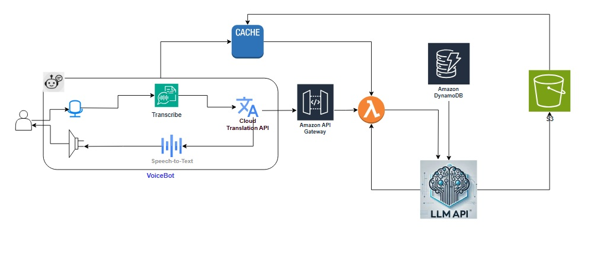

# Multilingual Voice Bot Application

## Overview

This application is a multilingual voice bot that allows users to interact with the system in their preferred language.  It leverages a combination of cloud-based services for speech recognition, translation, natural language processing, and bot logic.

## Architecture

The system architecture is illustrated in the following diagram:

**Key Components:**

* **User Interface:**
    * VoiceBot (User Interaction)
    * Amazon ECS (Containerized UI)
* **Speech Processing:**
    * Transcribe API (for Speech-to-Text)
* **Language Handling:**
    * Cloud Translation API (Language Translation)
* **Bot Logic:**
    * LLM API (Response Generation)
    * Lambda (Bot Logic)
* **API Management:**
    * Amazon API Gateway (API Requests)
    * SAM CLI (API Deployment)
* **Data Storage:**
    * Amazon DynamoDB (Conversation Data)
    * Cache (Cached Responses)
* **Output:**
    * Text-to-Speech API (for Speech output)
* **Static Assets:**
    * Amazon S3 (UI Files, long term context retention)
* **Deployment Pipeline:**
    * GitHub Actions (CI/CD)
    * Docker (Containerization)

## Deployment

* **User Interface:** The UI is deployed using Amazon ECS and GitHub Actions for continuous integration and continuous deployment (CI/CD). This ensures that updates to the user interface are automatically built, tested, and deployed whenever changes are pushed to the code repository.  

* **API Endpoint:** The API endpoint, which is handled by AWS Lambda and API Gateway, is deployed using SAM (Serverless Application Model) CLI with `sam deploy`. 

## Features

* Multilingual voice interaction.
* Dynamic language translation.
* Conversational AI powered by a Large Language Model.
* Scalable and reliable cloud-based architecture.
* Efficient response handling with caching.
* Text-to-speech output using Amazon Polly.
* Automated UI deployments with GitHub Actions and ECS.
* Simplified API deployments with SAM.
* Containerized UI for consistency and scalability.

## Technologies Used

* Speech-to-Text: AWS Transcribe
* Text-to-Speech: Amazon Polly
* Translation: Cloud Translation API (3rd party)
* LLM API: [Multiple 3rd party LLM APIs with Option to configure/replace]
* Backend: AWS Lambda
* API Gateway: Amazon API Gateway
* Database: Amazon DynamoDB
* Storage: Amazon S3
* Containerization: Docker, Amazon ECS
* CI/CD: GitHub Actions
* Deployment: AWS SAM CLI

## Usage

Users can interact with the voice bot through the VoiceBot interface, speaking in their preferred language. The bot will understand the request, generate an appropriate response, and deliver it back to the user in the same language using Amazon Polly for voice output.  The UI is deployed in a containerized environment managed by Amazon ECS, with updates automated through GitHub Actions.  The API is deployed using AWS SAM.

## Notes

* The architecture is designed for scalability and maintainability.
* Caching is implemented to improve the performance of frequently accessed information.
* The UI is deployed using Amazon ECS, Docker, and GitHub Actions for CI/CD.
* The API is deployed using AWS SAM CLI.
* Docker is used to containerize the UI, ensuring consistent deployments.
* GitHub Actions automates the UI build and deployment process.
